# Azure Databricks Deployment with Azure Datafactory

**Scenario Modeled**

Predicting the survival of Titanic passengers using passenger attributes like
age, gender, fare purchase price. Titanic dataset is a popular dataset from
Kaggle.

Data is stored as a csv file in Azure blob storage account mounted to Azure
Databricks file system. Machine Learning model is trained with logistic
regression from Python’s scikit-learn library using Databricks as a development
environment, the trained model is serialized as a pickle file. In the second
python script (or databricks notebook), the model is deserialized and used to
score the model, i.e., to make predictions. The data for making predictions is
stored in SQL DB as a table while the predictions produced by model is also
stored back to SQL DB as a separate table. Instead of writing data directly to
the database system (SQL DB), the data is written first in azure storage as a
file which is picked up by Azure data factory to load into SQL DB to handle
issues like connection failure and batch data load securely in a robust fashion.

**Brief Overview of Databricks Environment for Python development**

Databricks is an analytics platform widely used as an enterprise big data
platform on cloud. Databricks provides secure collaborative development
environment with critical enterprise features like active directory and source
control integration. Although Databricks is commonly used for building Spark
applications for processing large volume of data, we are using Databricks as our
ML development environment for building Python models using common libraries
like scikit-learn and pandas.

Common entities in Azure Databricks environment include:

-   **Notebooks:** Fundamental coding entity, commonly, defined as a live
    document with executable code. Databricks notebook conceptually are similar
    to Jupyter notebooks

-   **Cluster** is the fundamental compute infrastructure for running Databricks
    notebooks. A cluster contains one driver node (or VM) and zero or more
    worker nodes. Driver node is the VM that runs the master process and kicks
    of distributed spark jobs overs multiple worker nodes. As we are just
    writing plain Python code (and not using Spark), we set minimum number of
    worker nodes to be zero essentially making sure that all of our Python code
    is to run on the driver node where we pick the appropriate VM (cpu cores,
    memory, disk space) as per our job needs.

-   **Workspace:** Common environment for teams to work together. We can choose
    who gets access to the workspace and what type of access they got (read
    only, contributor, admin)

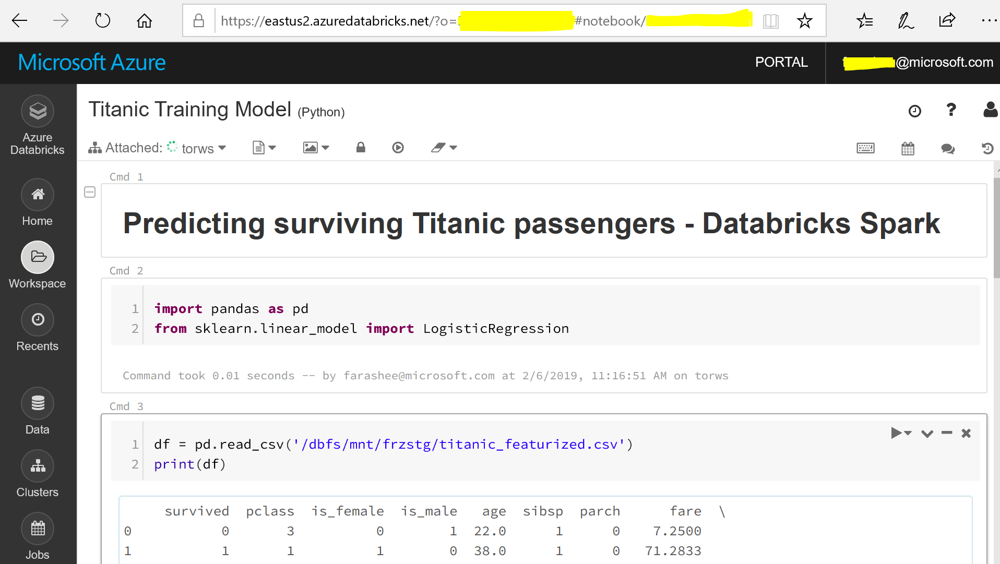

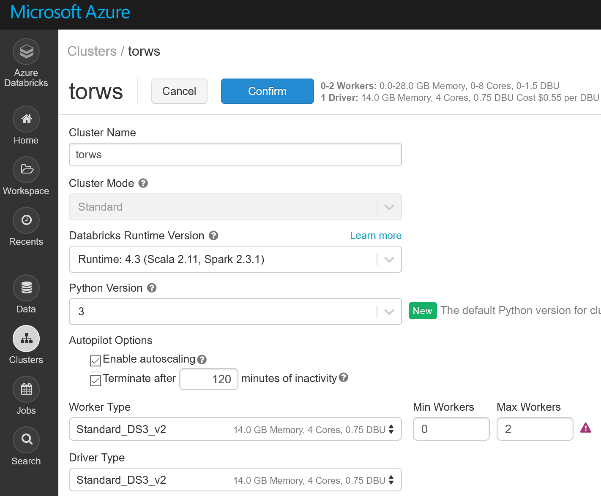

**Setting up Databricks environment**

-   **Mounting Azure storage to DB cluster**

Our training data is stored in Azure blob storage account which is a file based
storage service in Azure. In order to read data from blob storage account, we
need storage account name (along with optional container name, i.e., folder
within the storage account) and the access key. An efficient way of accessing
data from azure blob storage in databricks is to mount the storage account to
the databricks file system so the blob storage appears as a native file system
to python code. The following example shows the simple code to mount the ‘data’
folder in my azure storage account to the mount point ‘/mnt/frzstg/’

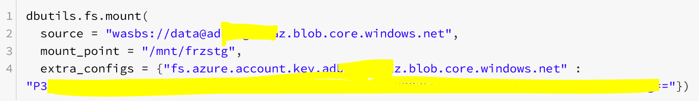

Once mounted, Python can access azure storage as native file system through the
mount point

-   **Databricks Secrets to store sensitive information**

You wouldn’t want to expose your sensitive information like username/passwords
in your python code sitting in databricks notebook. Databricks introduces the
concept of secret which is a sensitive information stored in a secure key-vault
but could be accessed through keys. We can secure our secrets by specifying who
(from active directory) can access the secrets stored in our key-vault. The
secrets are grouped together into an entity called secret scope. The easiest way
to create Databricks secret it through Databricks CLI (Command Line Interface).
With just few simple commands, you may create secret scopes and save your
secrets in there by typing in the popped-up notepad window

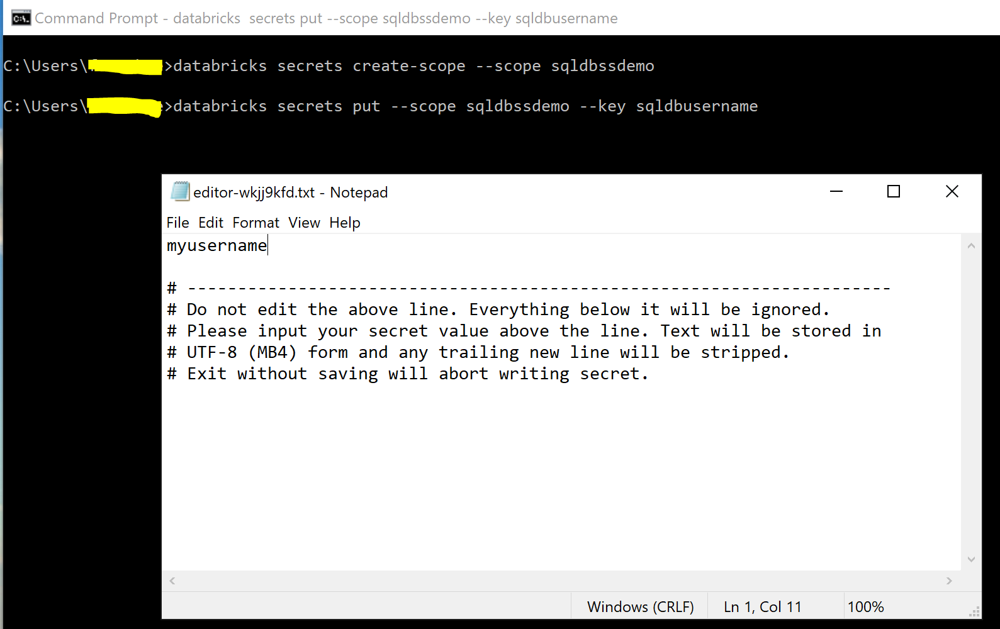

-   **Installing required Python libraries**

Often we would need additional python libraries within our code. For example, in
our scoring notebook, we used JayDeBeApi library to connect to Azure SQL DB
(using jdbc connection). In order to install it, we need to go to the
‘Libraries’ tab of our cluster and click the ‘Install New’ button and provide
the library name.

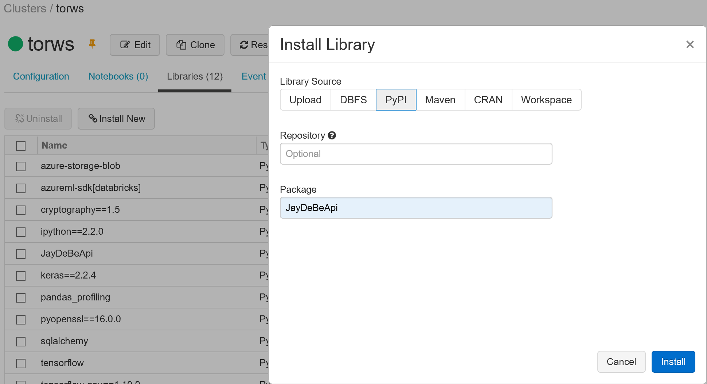

**Training model and serializing it as a pickle file**

Let’s build our first databricks notebook to train a simple ML model to predict
the survival of titanic passengers. We start with loading required python
libraries and to load our dataset into pandas dataframe. Note that the data is
read from mount point (to azure storage, created earlier) just like pandas would
read from local file system.

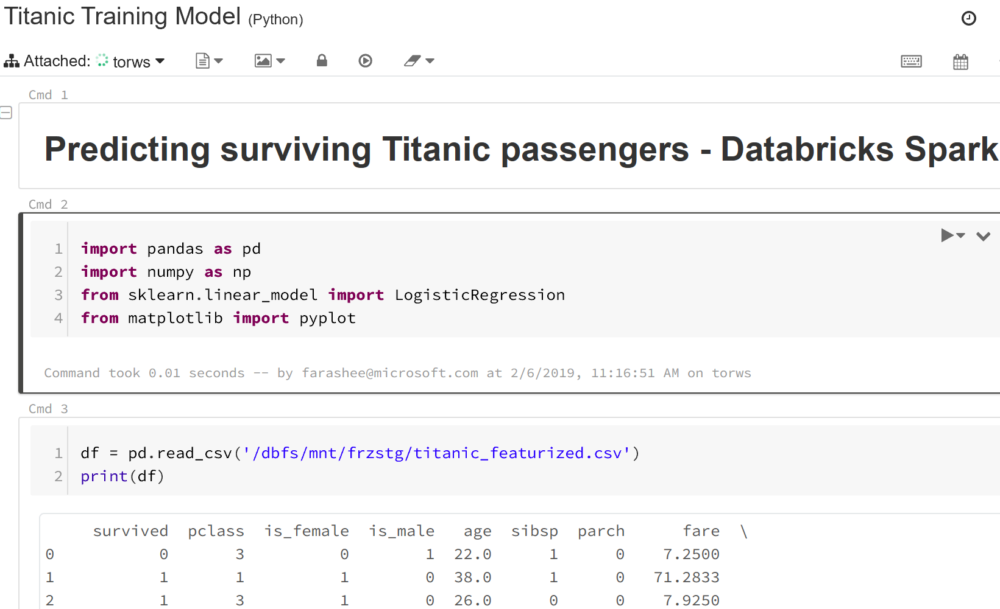

Feel free to download and take a look at the rest of the training notebook from [notebooks folder](databricks-notebooks/)

**Model scoring scenario**

Before we jump into the scoring code, let’s review our deployment scenario. We
now have got the model that know how to predict if a passenger is likely to
survive or not. Azure SQL DB is our production database system where we expect
to receive new passenger data every day in a specified table, thus we will setup
our model scoring (python) job to run every night, reading new passenger data,
produce predictions if they are likely to survive and store the results back to
a separate table in SQL DB. In our case, we write our predictions first to Azure
storage as a csv file and then load the data from there to the Azure SQL DB
database using Azure data factory. This helps us ensure that issues like
connection failures, incomplete writes and efficient data load is handled by a
mature orchestration tool like data factory. Such a decoupling also adds other
benefits like writing to multiple destinations and triggering another job not
discussed in this blog.

**Model scoring code**

We start our notebook with loading database connectivity attributes from our
secret scope

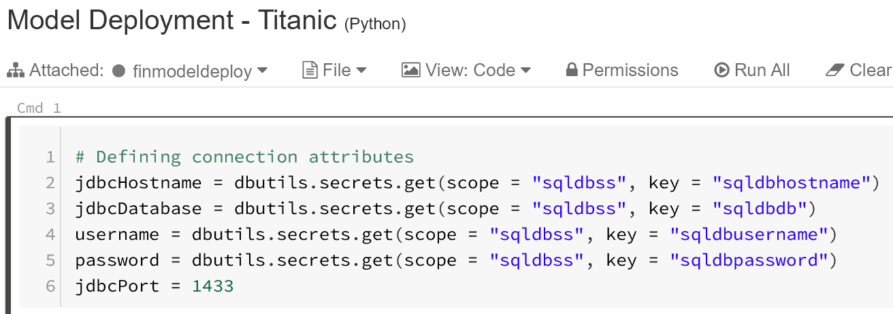

Next we setup our jdbc url and create a connection with jaydebeapi

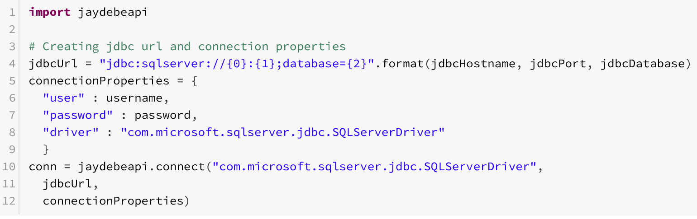

Pandas can now read from our table by just passing a simple SQL query

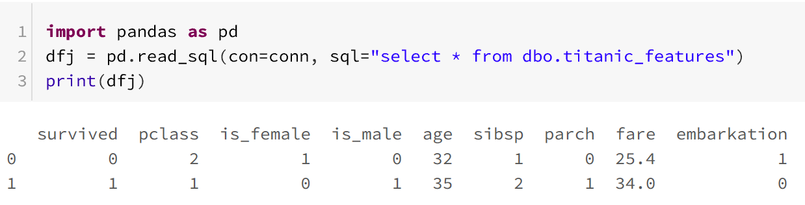

Now we are all set to load (deserialize) our model, make predictions for our
data and add our predictions as a column to loaded data

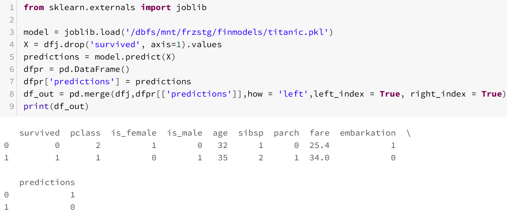

Finally let’s write our data including predictions as a csv file to our mounted
azure storage (don’t forget to close the jdbc connection, though!)

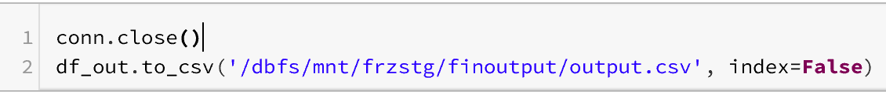

**Azure Data Factory Overview**

Azure Data Factory orchestrates production workflows, schedule and provide
workflow management and monitoring services. Data Factory is a browser based
tool and does not require any local installation. In our case, we use data
factory to automate our production job running our scoring databricks notebook
to generate new predictions and loading these to our SQL DB table.

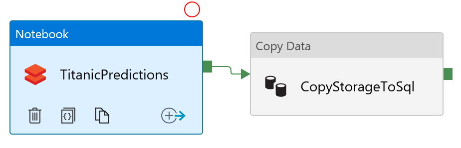

**Setting up Datasets**

Our scoring notebook loads data from SQL DB, generates predictions using our
trained model and writes the predictions to azure storage as csv file. In our
data factory pipeline, we need to copy this csv file from azure storage and load
the predictions to our SQL DB table. The two datasets involved are azure blob
storage and azure SQL DB

-   **Azure Blob Storage Dataset**

Setting up blob storage dataset involves providing storage account name and
access key to connect and pointing to the directory (container) or file that we
want to move

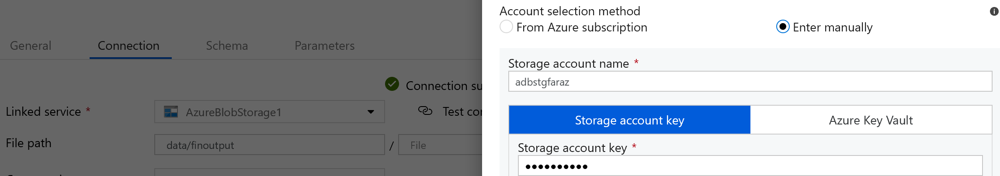

Next lets define schema for the referenced data, in most cases, we are able to
achieve this by clicking import schema to let data factory learn schema from the
csv file

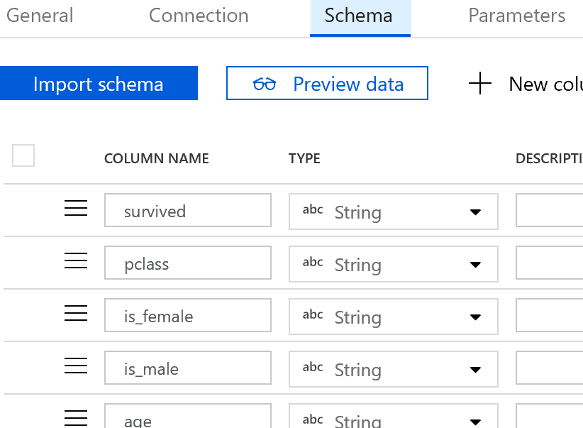

-   **Azure SQL DB Dataset**

Setting up Azure SQL DB as our second dataset involves providing connection
information and the target database and table. Please note that data factory may
read passwords and other sensitive information from Azure Key Vault. Next we let
data factory import referenced table schema just like we did for our blob
storage dataset

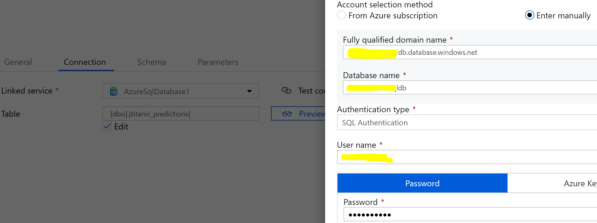

**Setting up Pipeline Activities**

Our workflow pipeline is straight forward here; run the databricks notebook to
generate predictions and copy the generated csv file from azure blob storage to
our target SQL DB table

-   **Databricks Notebook Activity**

Creating Azure Databricks notebook activity involves providing the Databricks
domain, access token and identifying if we want to use an existing cluster or
want to create a new cluster for the job (that would get terminated once the job
is complete). Next, we need to identify the target underlying notebook this
activity would be running

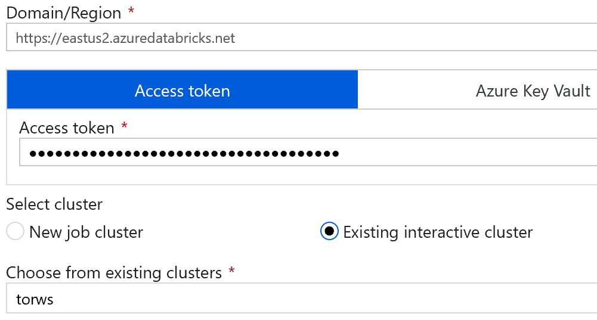

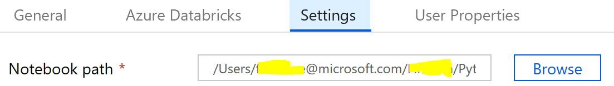

-   **Copy Activity**

Copy Activity is also very straight forward. We pick our blob storage dataset as
source, our SQL DB dataset as sink and define the field/column mapping for the
two sources. Please note that we defined a pre-copy script in our SQL DB sink to
delete the existing records in our target table. Since we already defined schema
is both of our datasets, schema mapping in copy activity is also very straight
forward. Such schema mapping becomes very handing when your source and sink
datasets do not have matching or same number of columns.

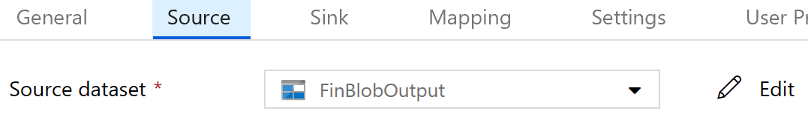

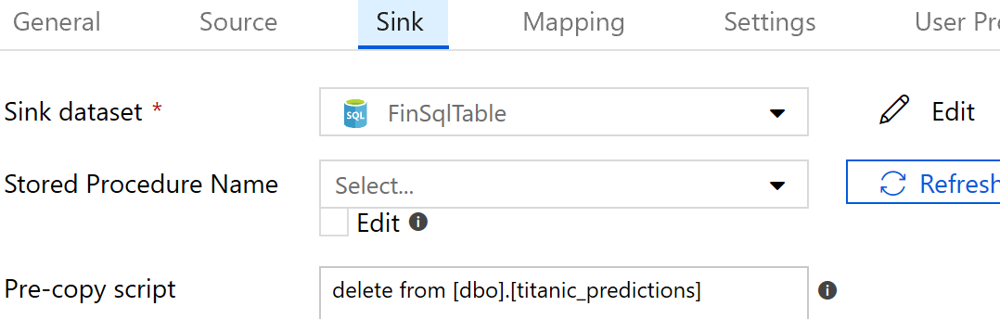

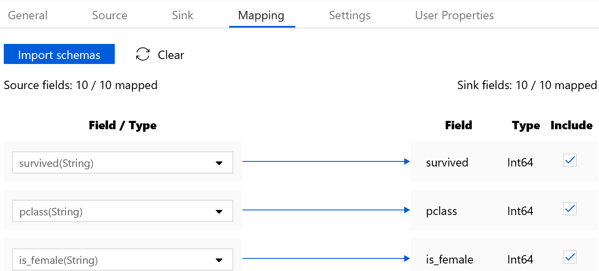

**Publishing and Validating Data Factory Pipeline**

As Data Factory is a web based tool, there is no save button for our dataflow.
We rather ‘publish’ our pipeline and validate its completeness with the
‘Validate’ link

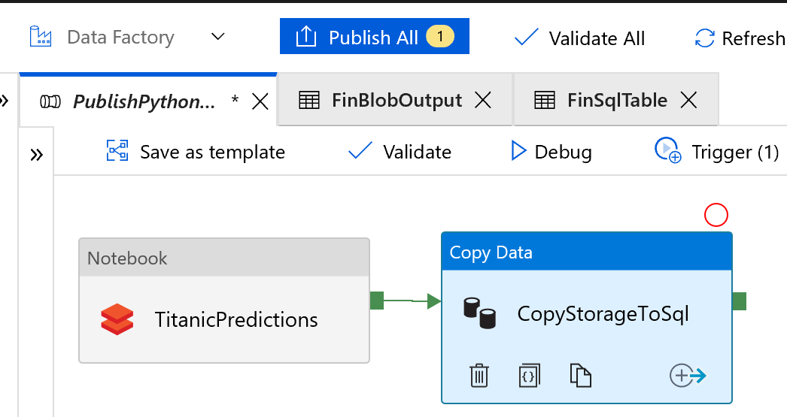

**Pipeline Scheduling**

Pipelines are scheduled by creating a ‘Trigger’ and scheduling properties

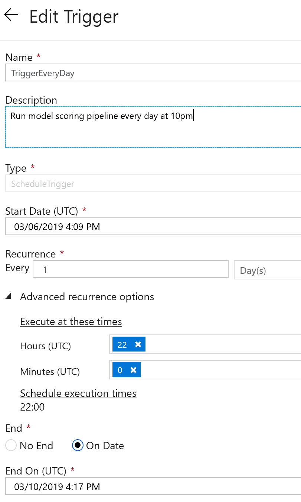

**Monitoring Pipeline Run**

The most attractive capability of data factory for our machine learning model
deployment is its monitoring and management platform. It lets you monitor
pipeline runs, their status (running, succeeded and failed) and to even drill
down into the status of individual activities within pipeline.

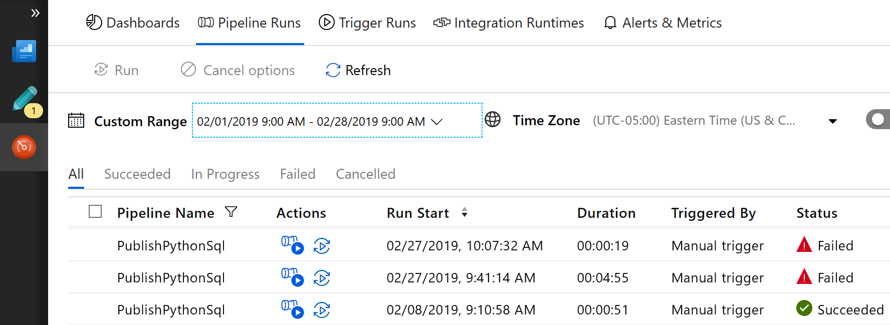

In case of an activity failure, we can drill down and in case of our databricks
notebook activity, we can even open the exact instance of databricks notebook
with cell status and error messages right within the notebook

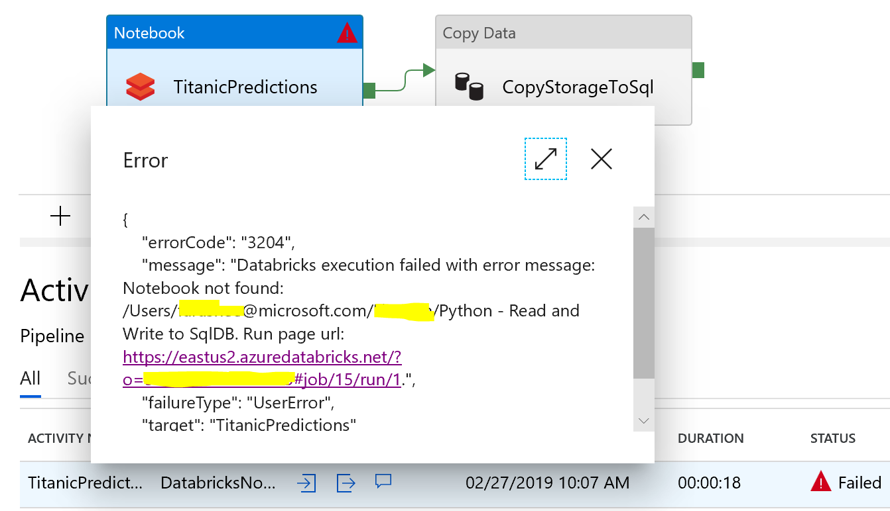

