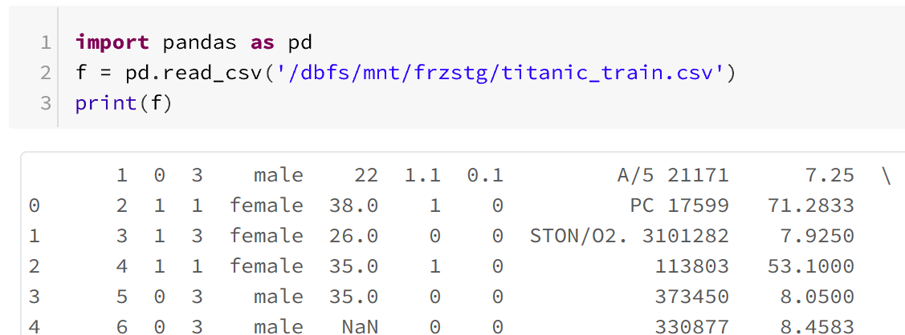

# azure-databricks-deployment-with-datafactory

**Scenario Modeled**

Predicting the survival of Titanic passengers using passenger attributes like
age, gender, fare purchase price. Titanic dataset is a popular dataset from
Kaggle.

Data is stored as a csv file in Azure blob storage account mounted to Azure
Databricks file system. Machine Learning model is trained with logistic
regression from Python’s scikit-learn library using Databricks as a development
environment, the trained model is serialized as a pickle file. In the second
python script (or databricks notebook), the model is deserialized and used to
score the model, i.e., to make predictions. The data for making predictions is
stored in SQL DB as a table while the predictions produced by model is also
stored back to SQL DB as a separate table. Instead of writing data directly to
the database system (SQL DB), the data is written first in azure storage as a
file which is picked up by Azure data factory to load into SQL DB to handle
issues like connection failure and batch data load securely in a robust fashion.

**Brief Overview of Databricks Environment for Python development**

Databricks is an analytics platform widely used as an enterprise big data
platform on cloud. Databricks provides secure collaborative development
environment with critical enterprise features like active directory and source
control integration. Although Databricks is commonly used for building Spark
applications for processing large volume of data, we are using Databricks as our
ML development environment for building Python models using common libraries
like scikit-learn and pandas.

Common entities in Azure Databricks environment include:

-   **Notebooks:** Fundamental coding entity, commonly, defined as a live
    document with executable code. Databricks notebook conceptually are similar
    to Jupyter notebooks

-   **Cluster** is the fundamental compute infrastructure for running Databricks
    notebooks. A cluster contains one driver node (or VM) and zero or more
    worker nodes. Driver node is the VM that runs the master process and kicks
    of distributed spark jobs overs multiple worker nodes. As we are just
    writing plain Python code (and not using Spark), we set minimum number of
    worker nodes to be zero essentially making sure that all of our Python code
    is to run on the driver node where we pick the appropriate VM (cpu cores,
    memory, disk space) as per our job needs.

-   **Workspace:** Common environment for teams to work together. We can choose
    who gets access to the workspace and what type of access they got (read
    only, contributor, admin)

**Setting up Databricks environment**

-   **Mounting Azure storage to DB cluster**

Our training data is stored in Azure blob storage account which is a file based
storage service in Azure. In order to read data from blob storage account, we
need storage account name (along with optional container name, i.e., folder
within the storage account) and the access key. An efficient way of accessing
data from azure blob storage in databricks is to mount the storage account to
the databricks file system so the blob storage appears as a native file system
to python code. The following example shows the simple code to mount the ‘data’
folder in my azure storage account to the mount point ‘/mnt/frzstg/’

Once mounted, Python can access azure storage as native file system through the
mount point

-   **Databricks Secrets to store sensitive information**

You wouldn’t want to expose your sensitive information like username/passwords
in your python code sitting in databricks notebook. Databricks introduces the
concept of secret which is a sensitive information stored in a secure key-vault
but could be accessed through keys. We can secure our secrets by specifying who
(from active directory) can access the secrets stored in our key-vault. The
secrets are grouped together into an entity called secret scope. The easiest way
to create Databricks secret it through Databricks CLI (Command Line Interface).
With just few simple commands, you may create secret scopes and save your
secrets in there by typing in the popped-up notepad window

-   **Installing required Python libraries**

Often we would need additional python libraries within our code. For example, in
our scoring notebook, we used JayDeBeApi library to connect to Azure SQL DB
(using jdbc connection). In order to install it, we need to go to the
‘Libraries’ tab of our cluster and click the ‘Install New’ button and provide
the library name.

**Training model and serializing it as a pickle file**

Let’s build our first databricks notebook to train a simple ML model to predict
the survival of titanic passengers. We start with loading required python
libraries and to load our dataset into pandas dataframe. Note that the data is
read from mount point (to azure storage, created earlier) just like pandas would
read from local file system.

Feel free to download and take a look at the rest of the training notebook from notebooks folder 
